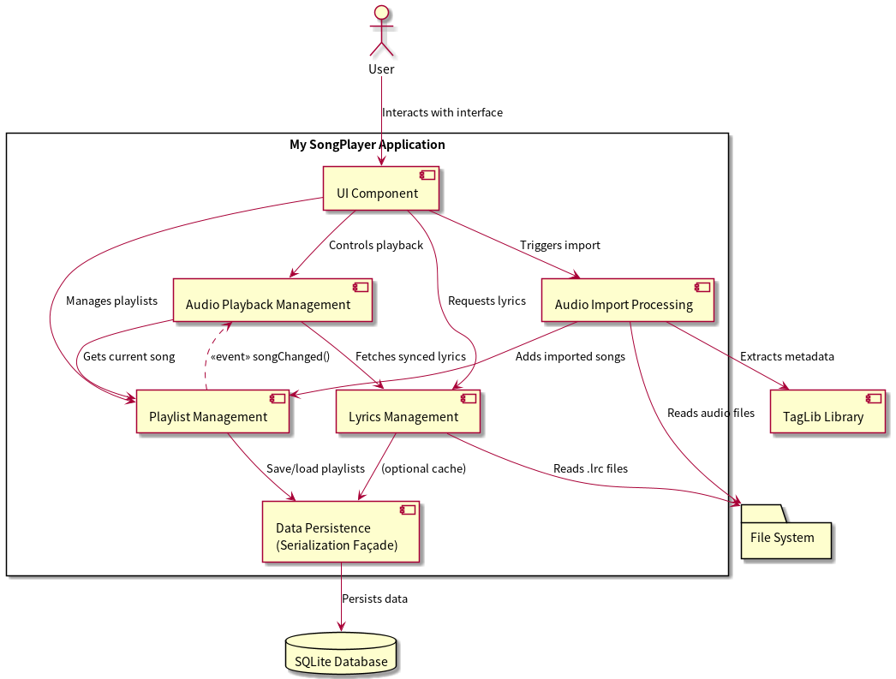
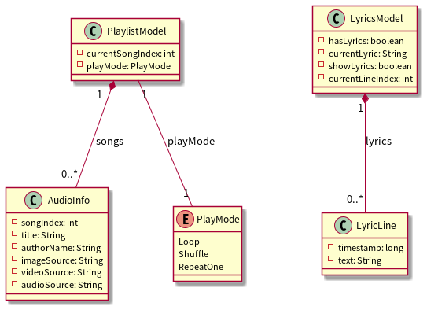

# MySongPlayer - 开发文档

**日期：** [2025-07-05]

---

## 1. 项目概述

### 1.1 项目简介
一个基于Qt Quick 和 C++ 的跨平台音乐播放器。

### 1.2 项目背景
Github上基于Qt的开源音乐播放器有很多，但是大部分项目的qt版本为qt5,于是就想基于qt6.8lts写一个。

### 1.3 主要功能

- **核心播放功能**
    - **多源格式支持:** 可以导入并播放多种本地音频格式 (MP3, FLAC, WAV等) 及网络URL流媒体。
    - **全面播放控制:** 提供音量调节、静音、精确的进度条拖拽，并支持列表循环、随机播放和单曲循环三种播放模式。
    - **智能元数据解析:** 自动从音频文件中提取歌曲信息（如标题、艺术家）并解析内嵌封面进行展示。

- **播放列表管理**
    - **灵活列表操作:** 支持对播放列表进行单曲/多曲添加、删除和清空等管理。
    - **列表持久化:** 可将当前播放列表保存到本地，并支持加载、重命名或删除已保存的列表。
    - **高效列表内搜索:** 提供强大的模糊搜索功能，支持按标题、艺术家等字段快速筛选歌曲。

- **同步歌词系统**
    - **LRC歌词支持:** 自动搜索并加载LRC格式歌词文件。
    - **实时同步高亮:** 实现歌词根据音频进度精确滚动，并高亮当前播放行。

---

## 2. 需求分析

### 2.1 功能性需求
- 基础的播放暂停，切歌功能。
- 一个可视的播放列表，可以增加/删除歌曲，歌曲多了以后需要列表搜索。
- 音量控制和进度条控制。
- 本地导入歌曲（支持多种格式）。
- 播放模式。
### 2.2 非功能性需求
- 跨平台需求： 应用在 Windows, Linux, macOS 三大主流操作系统上都能运行。
- 易用性需求： 用户界面应该简单易用，用户无需阅读文档即可使用。
- 可维护性需求： 代码需要便于新增功能或修复问题。

---

## 3. 系统设计

### 3.1 架构设计

**图1：系统技术架构图**

我们这个项目用了 **MVC + Coordinator** 这种分层设计，目的就是让前端（界面）和后端（处理逻辑）能分开干活，这样代码就好维护，以后想加功能也方便。

- **View (QML):** 这部分就是你看到的界面，负责显示东西和接收你的操作。它由一堆 `.qml` 文件组成，决定了界面长什么样，有哪些按钮，什么颜色。界面层会通过信号与槽的机制，还有属性绑定，跟C++后端通信。比如你点了按钮，它就会告诉 `PlayerController` 去处理，然后后端数据变了，它也会跟着更新界面。

- **Controller (C++):** 核心是 `PlayerController`，它是个“单例”（就是整个程序里只有一个）。它就像个“翻译官”，连接着QML前端和C++后端。它会把一些属性（`Q_PROPERTY`）和能调用的方法（`Q_INVOKABLE`）暴露给QML用，把复杂的业务流程都包起来，还管理着下面那些服务和数据的“生命周期”。这样QML就不用管那么多复杂的逻辑了，只管把界面画好就行。

- **Model (C++):** 这部分放着程序的核心数据，比如 `AudioInfo`（歌曲信息）、`PlaylistModel`（播放列表数据）和 `LyricsModel`（歌词数据）。这些数据模型设计出来就是为了让QML能直接用，或者通过 `PlayerController` 来访问。

- **Services (C++):** 这部分封装了具体的功能，比如 `AudioImporter`（负责导入歌曲和识别歌曲信息）、`LyricsService`（负责加载和解析歌词）和 `PlaylistStorageService`（负责保存播放列表）。服务层把具体实现和控制中心分开了，让它们各司其职。

- **Coordinators (C++):** 我们引入了协调器（比如 `PlaylistCoordinator`）来管理更复杂的业务流程，比如处理播放模式（顺序、随机、单曲循环）和歌曲切换。这样 `PlayerController` 的负担就更轻了，不会变得太臃肿。

- **Interfaces ( C++):** 这部分定义了服务和协调器之间怎么“沟通”的“规矩”（比如 `IPlaylistOperations`）。这样上层模块就不依赖下层模块的具体实现了，方便我们做测试和替换功能。

### 3.2 模块设计


**图2：系统模块关系图**

- **`controllers` (控制器):** 里面有 `PlayerController`，它是界面和后端逻辑的“总指挥”。它接收QML的请求，然后分发给相应的服务或协调器去处理。
- **`models` (数据模型):** 定义了程序里各种数据的结构。`PlaylistModel` 继承了 `QAbstractListModel`，所以QML的 `ListView` 可以直接用它来显示数据，数据更新也很方便。
- **`services` (服务):** 提供一些独立的小功能。比如 `PlaylistStorageService` 就专门负责跟 `PlaylistDatabase` 打交道，实现播放列表的增删改查。
- **`coordinators` (协调器):** 管理那些比较复杂、涉及到多个数据模型的业务逻辑。`PlaylistCoordinator` 就负责控制播放顺序，决定在不同播放模式下，下一首或上一首是哪首歌。
- **`storage` (存储):** 负责底层的数据存储。`PlaylistDatabase` 把所有跟SQLite数据库打交道的细节都包起来了，提供了一个清晰的数据访问接口。
- **`interfaces` (接口):** 定义了模块之间“沟通”的“规矩”，是实现系统“松耦合”（就是模块之间依赖关系不那么紧密）的关键。
---

## 4. 技术选型

| 类别 | 技术 | 说明 |
| :--- | :--- | :--- |
| 前端 | Qt/Qml | Qt Quick 提供的跨平台功能。
| 后端 | Qt/C++ | C++负责处理核心的播放、文件读写和数据管理，这样速度快，效率高。Qt的核心功能（比如元对象系统和信号与槽）能让C++后端和QML前端“无缝对接”。
| 数据库 | SQLite | 这个数据库用起来比较简单，部署也方便。

---

## 5. 接口设计（API）

前端和后端主要通过 `PlayerController` 这个“中间人”来交流。`PlayerController` 里面有一些“属性”（`Q_PROPERTY`）和“方法”（`Q_INVOKABLE`），它被注册成了一个QML的“单例”（就是QML里可以直接用它），所以QML可以直接访问它。

### 5.1 核心属性

这些“状态”会通过 `NOTIFY` 信号来更新界面。当C++后端的数据变了，QML界面就会自动跟着变。

| 属性 | 类型 | 描述 |
| :--- | :--- | :--- |
| `playing` | `bool` | 是否播放。 |
| `duration` | `qint64` | 歌曲总时长（毫秒）。 |
| `position` | `qint64` | 播放位置（毫秒）。 |
| `volume` | `float` | 音量大小 (0.0 - 1.0，0是没声，1是最大声)。 |
| `muted` | `bool` | 是否静音。 |
| `currentSong` | `AudioInfo*` | 现在正在放的歌是哪首。 |
| `playMode` | `int` | 播放模式 (0: 列表循环, 1: 随机播放, 2: 单曲循环)。 |
| `lyricsModel` | `LyricsModel*` | 歌词数据模型。

### 5.2 核心方法

这些“操作”可以直接在QML里调用，让后端去干活。

**播放控制:**
- `playPause()`: 播放或者暂停。
- `setPosition(qint64 newPosition)`: 跳到歌的某个位置。
- `switchToNextSong()`: 切到下一首。
- `switchToPreviousSong()`: 切到上一首。
- `switchToAudioByIndex(int index)`: 播放列表里指定位置的歌。

**播放列表操作:**
- `playlistModel()`: 获取播放列表的数据。
- `addAudio(...)`: 加一首网络上的歌。
- `removeAudio(int index)`: 从播放列表里删掉指定位置的歌。
- `clearPlaylist()`: 把播放列表清空。
- `importLocalAudio(const QList<QUrl>& fileUrls)`: 从本地电脑导入一首或多首歌曲。

**播放列表保存与管理:**
- `saveCurrentPlaylist(const QString &playlistName)`: 把当前播放列表保存起来。
- `loadPlaylist(const QString &playlistName)`: 加载之前保存的播放列表。
---

## 6. 快速开始

### 6.1 安装依赖

- **Qt版本:** Qt 6.5 或者更新的版本（我们用的是 6.8 LTS）。
- **C++编译器:** 能支持C++17标准的编译器（比如GCC、Clang、MSVC）。
- **构建工具:** CMake 3.16 或者更新的版本。
- **数据库:** SQLite 3.x。

### 6.2 构建和运行

1.  **克隆仓库：**
    ```bash
    git clone https://github.com/your-username/MySongPlayer.git
    cd MySongPlayer
    ```

2.  **配置和构建（用CMake）：**
    ```bash
    # 创建构建目录
    mkdir build && cd build

    # 运行 CMake 进行配置
    cmake ..

    # 编译项目（Linux/macOS系统用这个）
    make -j$(nproc)

    # 或者（Windows系统用Visual Studio的话用这个）
    cmake --build . --config Release
    ```

3.  **运行程序：**
    构建成功后，你会在 `build` 目录或者 `build/bin` 目录里找到可执行文件。
    ```bash
    ./MySongPlayer
    ```

4.  **打包（Linux AppImage）：**
    我们提供了一个脚本 `scripts/build-appimage.sh`，可以在Linux上把程序打包成AppImage格式，方便分发。
    ```bash
    cd scripts
    ./build-appimage.sh
    ```


---

## 7. 项目管理与分工

| 成员 | 负责模块/任务 |
| :--- | :--- |
| 陈瀚钦 | 负责播放器后端、界面实现、播放列表保存实现。|
| 任纹萱|  负责歌词解析和显示、播放模式、播放列表搜索。|


**协作工具**
- **版本控制：** Git 
- **代码托管：** Github

---

 ## 8. 成果展示                                                                                                                                      
 - 见根目录展示视频   

---

## 9. 总结与展望

### 9.1 项目总结

- 项目成功实现了包括多格式音频播放、播放列表持久化、歌词同步显示在内的全部核心功能。开发过程也提供了宝贵经验，尤其是在如何利用C++处理复杂业务逻辑方面。

### 9.2 问题与反思
- 初期添加本地文件导入，进度条，音量条控制功能后PlayerController类的实现变得很长，难以维护，于是在原有MVC的基础上引入了Coordinator并重构PlayerController类，实现了一定程度的解耦。
- 刚开始实现解析歌词功能时，歌词文件文件名要和音频文件名严格一致才能成功解析，这样的体验并不好（比如音频文件名会带歌手，乐队等信息，但是下载的歌词文件的文件名只有歌曲名），后来通过模糊匹配方法（用分数代表匹配程度，然后进行比较）解决了这个问题。
- 遇到了某些歌曲无法播放的问题。查看解析歌曲时的debug输出发现一些歌曲内嵌视频流导致音频的起始播放位置偏移了几毫秒，而我设置的播放起始位置为0，因此无法播放。解决方法：只需要设置一个稍大但用户不感知的起始位置即可，比如代码中设置播放起始位置为100ms。


### 9.3 未来展望
后续优化内容：

- 每次添加音频时都会重新生成整个shuffle序列（`generateShuffleSequence()`），在播放列表较大时会造成严重性能开销。当播放列表包含数百首歌曲时，每次添加新歌都会触发O(n)的重新洗牌操作。
- importLocalAudio方法采用串行处理多个音频文件，没有利用多线程并行处理。导入大量音频文件时会造成UI阻塞。
- 数据库操作缺少批量插入优化。在保存大型播放列表时，每个音频项都单独执行INSERT语句，效率低下。 
- 有些组件之间耦合度高，PlayerController虽然是代理类和外观模式但仍然承担了过多职责，违反了单一职责原则。
- 接口（如IPlaylistOperations）设计有点宽泛，可能导致实现类承担过多职责。
- 添加歌曲的简单编辑（添加歌词，封面等）功能。